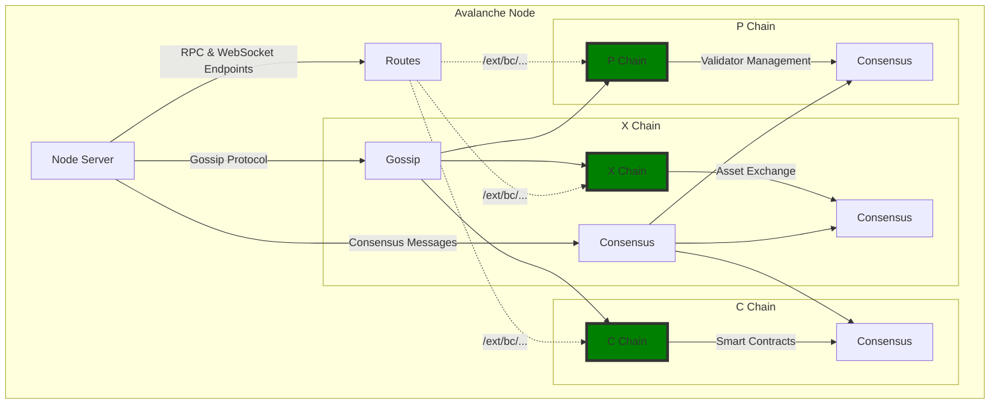
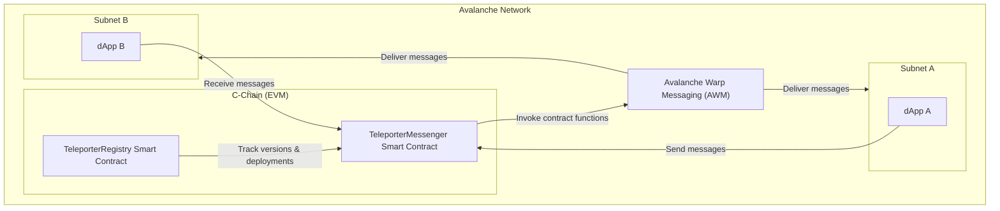
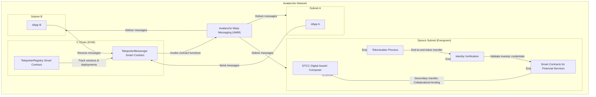
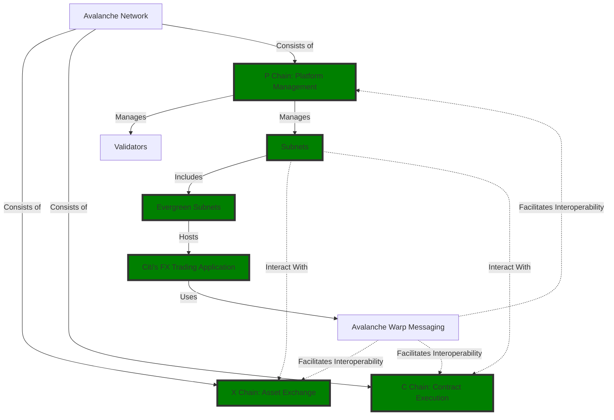
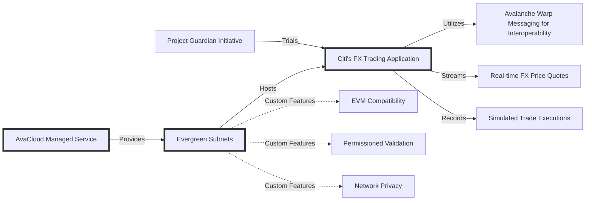
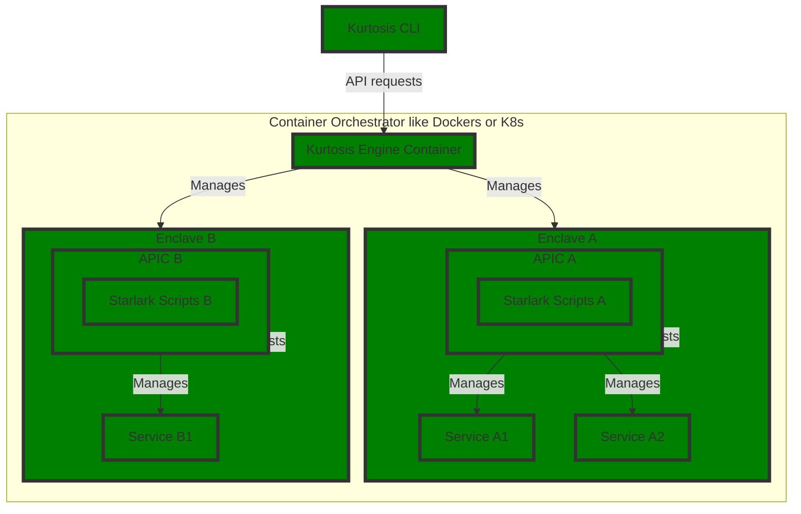

:small_red_triangle: Avalanche Package
======================================
This is a [Kurtosis package](https://docs.kurtosis.com/concepts-reference/packages) that spins up a non-staking Avalanche node. By default, this package works locally over Docker but can also be deployed on Kubernetes if so desired. You may optionally specify the number of nodes you wish to start locally with a simple `arg` passed in at execution time.

<!-- TOC -->
* [:small_red_triangle: Avalanche Package](#small_red_triangle-avalanche-package)
  * [Run this package](#run-this-package)
  * [Overall Avalanche architecture](#overall-avalanche-architecture)
    * [Avalanche Nodes & Chains](#avalanche-nodes--chains)
    * [Teleporter Messaging](#teleporter-messaging)
  * [Citibank Use Case](#citibank-use-case)
    * [Evergreen Subnets](#evergreen-subnets)
    * [Project Guardian Initiative](#project-guardian-initiative)
  * [Overall Kurtosis Architecture](#overall-kurtosis-architecture)
  * [Configuration](#configuration)
  * [Custom Subnet Genesis](#custom-subnet-genesis)
  * [Fixed Ports](#fixed-ports)
  * [Use this package in your package](#use-this-package-in-your-package)
  * [Kubernetes Configuration](#kubernetes-configuration)
  * [Develop on this package](#develop-on-this-package)
<!-- TOC -->

Run this package
----------------
Open [the Kurtosis playground](https://gitpod.io/#/https://github.com/kurtosis-tech/playground-gitpod) and run:

```bash
kurtosis run github.com/kurtosis-tech/avalanche-package
```
To run it locally, [install Kurtosis][install-kurtosis] and run the same.

To blow away the created [enclave][enclaves-reference], run `kurtosis clean -a`.

## Avalanche architecture
### Avalanche Nodes & Chains


The P, C, and X chains within the Avalanche platform are designed to fulfill distinct roles but are interconnected and communicate with each other:

1. **P-Chain (Platform Chain)**: The P-Chain manages the Avalanche network's validators, tracks active subnets, and enables the creation of new subnets. Communication with the X and C chains can be necessary for:
   - Validator management: Validators might have stakes in multiple chains, requiring coordination between the P-Chain (which manages staking and consensus) and other chains.
   - Subnet creation and management: As the P-Chain oversees subnets, creating a blockchain on a subnet (whether on the X or C chain) requires coordination to ensure proper setup and validation.

2. **X-Chain (Exchange Chain)**: The X-Chain facilitates asset creation and exchange. Interactions with the P and C chains include:
   - Cross-chain asset transfers: Users might want to move assets between the X-Chain and C-Chain for different purposes, such as using X-Chain assets within smart contracts on the C-Chain.
   - Staking rewards and fees: Validators and delegators earn rewards for their services, which might involve transferring assets across chains.

3. **C-Chain (Contract Chain)**: The C-Chain supports smart contracts using the Ethereum Virtual Machine (EVM). Reasons for communication with the P and X chains include:
   - Smart contracts involving multiple asset types: Contracts might interact with assets from the X-Chain or require information from the P-Chain.
   - Decentralized finance (DeFi) applications: DeFi platforms may use assets across the Avalanche ecosystem, necessitating seamless asset flow between chains.

Inter-chain communication in Avalanche is facilitated through cross-chain transfer protocols, enabling assets and information to move securely between the P, C, and X chains. This interconnectedness allows Avalanche to offer a comprehensive blockchain platform supporting various use cases, from simple asset transfers to complex smart contracts and decentralized applications.

### Questions and Answers

1. **Tokens**: So can you only have token balances on the X-chain? I mean, if the C-chain is for smart contracts and is EVM-compatible this means you can have an ERC20 token right there no?

    **Answer**: Yes, you are correct. While the X-Chain (Exchange Chain) in Avalanche is designed for creating and trading digital assets with complex custom rule sets, the C-Chain (Contract Chain) is fully EVM-compatible and supports smart contracts. This means that you can indeed create, deploy, and manage ERC20 tokens (and other types of tokens supported by the Ethereum ecosystem) directly on the C-Chain. Token balances related to these ERC20 tokens and interactions with them (transfers, allowances, etc.) are handled within the C-Chain.

2. If UniSwap is on Avalanche, would it need to read and write token balances from / to the X-chain and deploy its other smart contracts on the P-Chain?

    **Answer**: Uniswap, or any other decentralized exchange (DEX) platform that is deployed on the Avalanche C-Chain, would primarily interact with ERC20 tokens directly on the C-Chain. Since the C-Chain supports smart contracts and is EVM-compatible, Uniswap's smart contracts (such as liquidity pools and swapping functions) would be deployed on the C-Chain, not the P-Chain. The P-Chain (Platform Chain) is used for coordinating validators, creating subnets, and staking AVAX, not for deploying general-purpose smart contracts. Therefore, Uniswap would not need to deploy its smart contracts on the P-Chain, nor would it need to read and write token balances from/to the X-Chain for its operations. Transactions and token balances related to the trading activities on Uniswap would be managed within the C-Chain ecosystem.


### Teleporter Messaging



## Citibank Use Case Private Markets Tokenization

The use cases tested included:

- End-to-end token transfer: ABN AMRO’s wealth management arm instructed Citi to tokenize and transfer the Wellington-issued private equity fund to a WisdomTree client wallet on Avalanche Spruce while leveraging encoded compliance checks and identity credentials issued by WisdomTree and Tokeny. 
- Secondary transfer to enable trading: Enabled bilateral tokenized fund transfer on Spruce between WisdomTree clients also leveraging encoded compliance checks and identity credentials.
- Validating new capabilities with collateralized lending: Using DTCC Digital Assets’ Composer, lending and collateral smart contracts were deployed on Spruce to process an end to end securities lending transaction where an investor pledged tokenized private equity funds to borrow WisdomTree Money Market fund tokens.

## Citibank Use Case FX Trading
### Evergreen Subnets



### Project Guardian Initiative



Overall Kurtosis Architecture
----------------

## Configuration

<!-- You can parameterize your package as you prefer; see https://docs.kurtosis.com/next/concepts-reference/args for more -->
You can configure this package using the following JSON structure (keys and default values):

```javascript
{
    "dont_start_subnets": false,
    "is_elastic": false,
    "ephemeral_ports": true,
    "avalanchego_image": "avaplatform/avalanchego:v1.10.1-Subnet-EVM-master",
    "node_config": {
        "network-id": "1337",
        "staking-enabled": false,
        "health-check-frequency": "5s"
    },
    "node_count": 5,
    "min_cpu": 0,
    "min_memory": 0,
    "vm_name": "testNet",
    "chain_name": "testChain",
    "custom_subnet_vm_path": "",
    "custom_subnet_vm_url": "",
    "subnet_genesis_json": "github.com/kurtosis-tech/avalanche-package/static_files/genesis.json"
}
```

For example:
Running:
```bash
kurtosis run github.com/kurtosis-tech/avalanche-package '{"node_count":3}'
```
will spin up 3 non-stacking Avalanche nodes locally.


| Key                 | Meaning                                                                                                                |
| ------------------- | -----------------------------------------------------------------------------------------------------------------------|
| dont_start_subnets  | If set to true; Kurtosis won't start subnets (default: False)                                                          |
| is_elastic          | If set to true; Kurtosis will start elastic subnets (default: False)                                                   |
| ephemeral_ports     | Docker only. If set to false Kurtosis will expose ports 9650, 9652 and so on for rpc ports and 9651, 9653 and so on for staking (default: true)|
| avalanchego_image   | The image to start the node with (default: avaplatform/avalanchego:v1.10.1-Subnet-EVM-master)|
| node_count  | Number of nodes to start the cluster with (default: 5) |
| node_config.network-id  | The ID of the primary network to spin up |
| node_config.staking-enabled  | Whether staking is enabled on the node |
| node_config.health-check-frequency  | Interval at which to check health |
| num_validators  | Number of validator nodes to start the cluster with. (default: node_count)         |
| min_cpu  | K8S only. Minimum cpu in millicores per avalanche node that Kurtosis spins up (default: 0)         |
| min_memory  | K8S only. Minimum memory in megabytes per avalanche node that Kurtosis spins up (default: 0)         |
| vm_name  | The name to assign to the VM and dervie vm id from (default: testNet)         |
| chain name  | The alias to assign to the chain (default: testChain)         |
| custom_subnet_vm_path  | If supplied Kurtosis will use this as the VM to use for the subnet it spins up|
| custom_subnet_vm_url  | If supplied Kurtosis will download and use this as the VM to use for the subnet it spins up|
| subnet_genesis_json  | If you are using this package from a different package you can override the default genesis for the subnet using this argument|

**NOTE**: Passing arguments as JSON string to the CLI might be to cumbersome. You can use the following syntax too `kurtosis run . "$(cat args.json)"`. There's an `args.json` at the root of the project that you can use. It has the defaults set so feel free to tweak it.

## Custom Subnet Genesis

By default Kurtosis runs the subnet chain with the `genesis.json` at `static_files/genesis.json`. To bring your own `genesis.json` you should - 

1. Clone the repository
2. Replace that file with the right values
3. Run the package with `kurtosis run .` to ensure that you are running local code
4. Optionally you can publish this to a fork and use that with `kurtosis run` passing a remote GitHub path

By updating the `genesis.json` you can change the initial allocations, chain id, gas configuration and a lot of other config

Various different [precompiles](https://docs.avax.network/subnets/customize-a-subnet#precompiles) can also be configured by bringing your own genesis.json

## Fixed Ports

Use the `{"ephemeral_ports": false}` argument to get fixed ports, rpc ports will be on 9650, 9652, 9654 and so on while non staking ports will be on 9651, 9653, 9655 and so on.

Use this package in your package
--------------------------------
Kurtosis packages can be composed inside other Kurtosis packages.  Assuming you want to spin up an Avalanche node and your own service
together, you just need to do the following in your own package:


```python
# First, import this package by adding the following to the top of your package's Starlark file:
this_package = import_module("github.com/kurtosis-tech/avalanche-package/main.star")
```

Then, call the this package's `run` function later in your package's Starlark script:

```python
this_package_output = this_package.run(plan, args)
```

By using the `subnet_genesis_json` argument you can pass the url of a `genesis.json` in your own package to use a different genesis file for the subnet.

## Kubernetes Configuration

To run this on Kubernetes you need to configure your CLI to work with Kubernetes using [this guide](https://docs.kurtosis.com/k8s/)

Further the chain rpc url that gets printed at the end won't be directly accessible as the IP address printed there is internal to `K8S`; you will have to replace
the URL slightly like given the following input - 

`http://172.16.5.3:9650/ext/bc/2hzMp2mNsBpCHRMkyaM6gR1tgeV4sTGuDx8WD2uG5LwTEPfpZe/rpc`

Keep everything but replace the ip address with `127.0.0.1` and the port `9650` with any of the rpc ports listed in `kurtosis enclave inspect`. As an example

```
========================================== User Services ==========================================
UUID           Name      Ports                                  Status
426da692eea4   builder   <none>                                 RUNNING
09d0bbc70f9b   node-0    rpc: 9650/tcp -> 127.0.0.1:61837       RUNNING
                         staking: 9651/tcp -> 127.0.0.1:61838
cd172a584033   node-1    rpc: 9650/tcp -> 127.0.0.1:61839       RUNNING
                         staking: 9651/tcp -> 127.0.0.1:61840
0d6a4daf23ee   node-2    rpc: 9650/tcp -> 127.0.0.1:61834       RUNNING
                         staking: 9651/tcp -> 127.0.0.1:61835
```

The final url would look like `http://127.0.0.1:61834/ext/bc/2hzMp2mNsBpCHRMkyaM6gR1tgeV4sTGuDx8WD2uG5LwTEPfpZe/rpc`

Develop on this package
-----------------------
1. [Install Kurtosis][install-kurtosis]
1. Clone this repo
1. For your dev loop, run `kurtosis clean -a && kurtosis run .` inside the repo directory


<!-------------------------------- LINKS ------------------------------->
[install-kurtosis]: https://docs.kurtosis.com/install
[enclaves-reference]: https://docs.kurtosis.com/concepts-reference/enclaves
